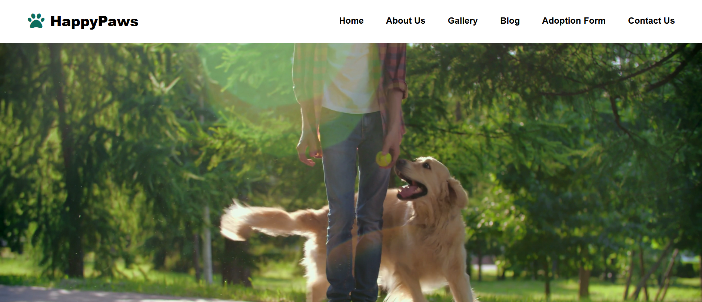

# Pet Adoption - Responsive Webpage

Welcome to the **Pet Adoption** responsive webpage repository!  
This project presents a modern, attractive, and fully responsive website for pet adoption using only HTML and CSS—no frameworks, no JavaScript. It’s designed to engage visitors, convey professionalism, and encourage pet adoption.

## 🚀 Features

- **Responsive Design**: Looks great on desktops, tablets, and mobiles.
- **Visually Engaging**: Clean layout, vibrant imagery, and modern typography.
- **Easy Customization**: Simple HTML and CSS structure for effortless edits.
- **Professional Appeal**: Suitable for real-world adoption agencies or portfolio projects.

## 🌟 Demo

- **Live Preview**: [View Website](#)
- **Screenshot**:  
  

## 📂 Project Structure

```
pet-adoption/
│
├── index.html        # Main HTML file
├── style.css         # Main CSS file
├── screenshot.png    # Demo screenshot (replace with your own)
└── README.md         # Project documentation
```

## 📝 Getting Started

1. **Clone the Repository**
   ```bash
   git clone https://github.com/yourusername/pet-adoption.git
   cd pet-adoption
   ```

2. **Open the Webpage**
   - Open `index.html` in your browser.

3. **Customize**
   - Replace images, update content, and tweak styles in `style.css` as needed.

## 🎨 Customization

- **Images**: Replace placeholder images with your own pet photos.
- **Colors & Fonts**: Modify in `style.css` to match your branding.
- **Content**: Edit text in `index.html`.

## 🤝 Contributing

Contributions are welcome! Feel free to fork this repo, submit pull requests, or open issues.

## 📄 License

This project is licensed under the [MIT License](LICENSE).

---

**Made with ❤️ for animal lovers everywhere!**